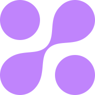

<a name="readme-top"></a>

<!-- PROJECT SHIELDS -->

[![Contributors][contributors-shield]][contributors-url]
[![Forks][forks-shield]][forks-url]
[![Stargazers][stars-shield]][stars-url]
[![Issues][issues-shield]][issues-url]
[![MIT License][license-shield]][license-url]
[![LinkedIn][linkedin-shield]][linkedin-url]

<!-- PROJECT LOGO -->
<br />
<div align="center">
  <a href="https://github.com/raymondkneipp/bioboost-app">
    
  </a>

<h3 align="center">BioBoost App</h3>

  <p align="center">
    Reach your goals faster with this health and productivity tool.
    <br />
    <a href="https://github.com/raymondkneipp/bioboost-app"><strong>Explore the docs »</strong></a>
    <br />
    <br />
    <a href="https://github.com/raymondkneipp/bioboost-app">View Demo</a>
    ·
    <a href="https://github.com/raymondkneipp/bioboost-app/issues">Report Bug</a>
    ·
    <a href="https://github.com/raymondkneipp/bioboost-app/issues">Request Feature</a>
  </p>
</div>

<!-- TABLE OF CONTENTS -->
<details>
  <summary>Table of Contents</summary>
  <ol>
    <li>
      <a href="#about-the-project">About The Project</a>
      <ul>
        <li><a href="#built-with">Built With</a></li>
      </ul>
    </li>
    <li>
      <a href="#getting-started">Getting Started</a>
      <ul>
        <li><a href="#prerequisites">Prerequisites</a></li>
        <li><a href="#installation">Installation</a></li>
      </ul>
    </li>
    <li><a href="#roadmap">Roadmap</a></li>
    <li><a href="#contributing">Contributing</a></li>
    <li><a href="#license">License</a></li>
    <li><a href="#contact">Contact</a></li>
    <li><a href="#acknowledgments">Acknowledgments</a></li>
  </ol>
</details>

<!-- ABOUT THE PROJECT -->

## About The Project

[![BioBoost App Screenshot][product-screenshot]](https://app.bioboost.fit)

<p align="right">(<a href="#readme-top">back to top</a>)</p>

### Built With

- [![Next][next.js]][next-url]
- [![React][react.js]][react-url]
- [![Tailwind CSS][tailwindcss]][tailwindcss-url]
- [![HeadlessUI][headlessui]][headlessui-url]
- [![React Hook Form][reacthookform]][reacthookform-url]
- [![Next Auth][nextauth]][nextauth-url]
- [![Prisma][prisma]][prisma-url]
- [![Railway][railway]][railway-url]
- [![tRPC][trpc]][trpc-url]

<p align="right">(<a href="#readme-top">back to top</a>)</p>

<!-- GETTING STARTED -->

## Getting Started

To get a local copy up and running follow these simple steps.

### Prerequisites

- npm

  ```sh
  npm install npm@latest -g
  ```

- PostgreSQL database
  - I recommend using either [PlanetScale](https://planetscale.com/) or [Railway](https://railway.app?referralCode=JMzfrz).

### Installation

1. Clone the repo
   ```sh
   git clone https://github.com/raymondkneipp/bioboost-app.git
   ```
2. Install NPM packages
   ```sh
   npm install
   ```
3. Set up the Next Auth DiscordProvider

- Head to [the Applications section in the Discord Developer Portal](https://discord.com/developers/applications), and click on “New Application”
- In the settings menu, go to “OAuth2 => General”
- Copy the Client ID and paste it in `DISCORD_CLIENT_ID` in `.env`.
- Under Client Secret, click “Reset Secret” and copy that string to `DISCORD_CLIENT_SECRET` in `.env`. Be careful as you won’t be able to see this secret again, and resetting it will cause the existing one to expire.
- Click “Add Redirect” and paste in `<app url>/api/auth/callback/discord` (example for local development: `http://localhost:3000/api/auth/callback/discord`)
- Save your changes

4. Set up Next Auth

- Set `NEXTAUTH_SECRET` in `.env` using output from `openssl rand -base64 32`

5. Connect to Database

- Set `DATABASE_URL` in `.env` to the connection URL provided by your database provider.

6. Push schema to database

```sh
npx prisma db push
```

7. Open Prisma Studio

```sh
npx prisma studio
```

8. Run the project

```sh
npm run dev
```

<p align="right">(<a href="#readme-top">back to top</a>)</p>

<!-- ROADMAP -->

## Roadmap

- [x] Habit Stacks
  - [ ] Order habits
  - [ ] Frequency (weekly, on these days, etc.)
  - [ ] Time to begin / complete
- [x] Bad Habits
- [ ] Goals
  - [ ] Short term goals (within 2 months)
  - [ ] Medium term goals (within 2 years)
  - [ ] Long term goals (2+ years)
  - [ ] SMART goals
- [x] Mood
  - "great", "good", "okay", "bad", "awful"
  - [ ] additional notes
- [ ] Journal
  - [ ] 3 things to accomplish tomorrow
  - [ ] List things you are grateful for
  - [ ] Yearly, monthly self reflection journal
- [ ] Water tracker
- [x] Weight tracker
- [ ] Sleep tracker
  - No electronics past X
- [ ] Caffeine tracker
  - No caffeine past X time
  - No more than X mg of caffeine per day
  - Feature to slowely taper down
- [ ] Time boxing
- [ ] Workout tracker
- [ ] Cardio tracker
- [ ] Meal tracker / meal planner
- [ ] Breathing exercises
- [ ] Meditation guides
- [ ] Intermittent fasting
- [ ] Stretching
  - Warm up / dynamic
  - Cool down / static
- [ ] Whiteboard
  - A place to write down ideas

See the [open issues](https://github.com/raymondkneipp/bioboost-app/issues) for a full list of proposed features (and known issues).

<p align="right">(<a href="#readme-top">back to top</a>)</p>

<!-- CONTRIBUTING -->

## Contributing

Contributions are what make the open source community such an amazing place to learn, inspire, and create. Any contributions you make are **greatly appreciated**.

If you have a suggestion that would make this better, please fork the repo and create a pull request. You can also simply open an issue with the tag "enhancement".
Don't forget to give the project a star! Thanks again!

1. Fork the Project
2. Create your Feature Branch (`git checkout -b feature/AmazingFeature`)
3. Commit your Changes (`git commit -m 'Add some AmazingFeature'`)
4. Push to the Branch (`git push origin feature/AmazingFeature`)
5. Open a Pull Request

<p align="right">(<a href="#readme-top">back to top</a>)</p>

<!-- LICENSE -->

## License

Distributed under the MIT License. See `LICENSE.txt` for more information.

<p align="right">(<a href="#readme-top">back to top</a>)</p>

<!-- CONTACT -->

## Contact

Raymond Kneipp - [@rfkquery](https://twitter.com/twitter_handle) - hello@raymondkneipp.com

Project Link: [https://github.com/raymondkneipp/bioboost-app](https://github.com/github_username/repo_name)

<p align="right">(<a href="#readme-top">back to top</a>)</p>

<!-- ACKNOWLEDGMENTS -->

## Acknowledgments

- [Create T3 App](https://create.t3.gg/)

<p align="right">(<a href="#readme-top">back to top</a>)</p>

<!-- MARKDOWN LINKS & IMAGES -->
<!-- https://www.markdownguide.org/basic-syntax/#reference-style-links -->

[contributors-shield]: https://img.shields.io/github/contributors/raymondkneipp/bioboost-app.svg?style=for-the-badge
[contributors-url]: https://github.com/raymondkneipp/bioboost-app/graphs/contributors
[forks-shield]: https://img.shields.io/github/forks/raymondkneipp/bioboost-app.svg?style=for-the-badge
[forks-url]: https://github.com/raymondkneipp/bioboost-app/network/members
[stars-shield]: https://img.shields.io/github/stars/raymondkneipp/bioboost-app.svg?style=for-the-badge
[stars-url]: https://github.com/raymondkneipp/bioboost-app/stargazers
[issues-shield]: https://img.shields.io/github/issues/raymondkneipp/bioboost-app.svg?style=for-the-badge
[issues-url]: https://github.com/raymondkneipp/bioboost-app/issues
[license-shield]: https://img.shields.io/github/license/raymondkneipp/bioboost-app.svg?style=for-the-badge
[license-url]: https://github.com/raymondkneipp/bioboost-app/blob/master/LICENSE.txt
[linkedin-shield]: https://img.shields.io/badge/-LinkedIn-black.svg?style=for-the-badge&logo=linkedin&colorB=555
[linkedin-url]: https://linkedin.com/in/linkedin_username
[product-screenshot]: public/screenshot.png
[next.js]: https://img.shields.io/badge/next.js-000000?style=for-the-badge&logo=nextdotjs&logoColor=white
[next-url]: https://nextjs.org/
[react.js]: https://img.shields.io/badge/React-20232A?style=for-the-badge&logo=react&logoColor=61DAFB
[react-url]: https://reactjs.org/
[trpc]: https://img.shields.io/badge/tRPC-111111?style=for-the-badge&logo=trpc&logoColor=#327DB9
[trpc-url]: https://trpc.io/
[prisma]: https://img.shields.io/badge/Prisma-ffffff?style=for-the-badge&logo=prisma&logoColor=5967D8
[prisma-url]: https://www.prisma.io/
[nextauth]: https://img.shields.io/badge/Next%20Auth-090909?style=for-the-badge&logo=data:image/png;base64,iVBORw0KGgoAAAANSUhEUgAAAEEAAABICAYAAACp+JiNAAATmUlEQVR4AcSZBZAsOZJEnyuzoP//w4zLvHvMzMzMzMzMzGd4zMzMsMw8zMzQnxuqMqW46kmFVVhaT9/yasxLUkjVM+5yhaQa8U4oP3nV7jNOnLbPe6AvX9rtduer9JuXTDf+cGMj/wVwI+/gou9/+UneEWU2m3zE5rL74nt7PuqOzCWbtI1osMUuKoJsnFNKubJpHrisTf9zpJ39EfD8d4gI3/W/HW+PcmRj+9ztef/pm136/Dv78l53Zztzp51LRVjXo2xgwhZLKIYQaIKaFQzmXW+XKZ26vGlecw725xtnHfo74NjbRYTve4nxtird5MFn9/Pp5z/Y5U+7ve+ffl+2qaaHoDfoMhTAhCzVuopg5rEhjoAGNS0SsCxcqLS4XHbr+Un/oLb8GXD920yEr/23U7yl5Tc//kj67msf/qhj2b74vtJ9xJ1df/HxZpLQZCDdl8HqlpANdWwLYYsFFIZYiON9hEiQEmqADGf0lEulB88Xzz+s8se/ddXh/wHKWywCP2a8OeU7P/+B8/u++8xHi33eXX33nneVfMZyMkdF2DKjHFc7hbbXURBB3Q5j8jIBKbRdFEBC7RBql3BxsVMXkV53FvbnuvzQ3wBH3ywRvvLlB4vwOx8gfcctdz17p+++4CErn3p7Xj7tvlKmaboBXRlQQMVJp/1Jh3iMUZ0AIoqjsRu8TYU5AwZBGrAlnFdYXpzTzWdR/rGdtn8K3AAHF33x3y0Yl7Ofd/dsBh9zMtkX3JOXH3prv3vRsaZJqIVlgb5ASfuT9LpUG5dAnjSIhWo95ARlA6poKArl/dD2ej82oAS0gMHGwsqFWQ+ek/X8w+3kj//0ovb5QM+oiBcYAD/41JsvW/Z8zqa6z7qnLN/lrrI4sjudknvol/2qNqwEkrEuUQxvB/Jjd4S2LRYosyZLAhsTjwLhMRBg7F8UXJKgWcB5Szt1Tk6vO9zZX9iVj22bTQD9+J3Xfvhdk/zrd5bdJz9MN8ntlG6Zyd0KhRXSCiJbopTwHxScMHbAKHZQjhicUMydEmzvc7x/sBsQB/bjtqGDM5ZanrssN09OLb++3VT+szceXlzcby2xvgyXlyz8H7mitt6EBkhgGMIwqzWGJIZiARrmaGhDJS0D1e8hCK3IAAnM/5KX2BsRjsO27lsH7AE4fdimuxM996PuXvxECxxhuUA5V9og2VBHaE0cc3Kerb0/HgtxKY4N5E14CfHaVa3CAsin+fgBKw+PmzfSDC5+pOOTrtnlvK2dpsXMcJKAzMZikBJYBkkUM+Sr56QR/mkKrjB3zXoexJV3cjViFhmBQGOy+xP3+uA80YASvNttO3z4ddvMu4Ze1reqiwRWiav2hzYG8rMZQ3FFnTSRJGH1LVh/RN5lkwX7e8v/PbWNk9NYQED//+oDmsJ81/jI607xLncsyQbFjF5Y67tcCVRgEMVIBiZI8lV2hxgmjewPRHcQ93AgPyI7zhteI6KormHYVl5zcIn2f7Tn415/iouOZnIxSgEDLGFtwUxhDSTAE6K5lSElKAWEKBgaJ0hzEp4gR+QcxtpBJhADiFuCoS2jdoI4UcaDxVADJHiXW3b4yKu3mC4G8gMMANqGdmmlJEHRYEGZkVx94flhjWSoEFxQoUDYgiuCH6qLKuewXSAICEIgi8mvijba99E9oev2ny0KH3nVFu92+4JSjOwC2CBGQ4JGr2nP6po3kNKHy0lKUNsJ8xWpY5UvYE48ihHtDEQxQjAKE3JAIGRBuPG+H6WDsdnc/hc+0vGJrz3NxZs9pUAO5L2PjH7Hrm2nlm4W5cMlz/GQEIWYMAW177C44uM7QzwWsYBALpwMgdiIVVC+dsd5In5HDdDA827Z5qPfsM1s1wbCA/kgQO2TSY1tttOS7qXPxGNyfFR6PkhmlJAv8DpaWsB+dwnGrhiNeZaRqpCPlyBtn2NSa/uvVv89bl5QDMrjkXdYV5rMZjvpdYdKWa+yc5HwU6JQ4zWGEWzs5ADDox7f/3QY3xlEjAXyBHHCBWmUIDXTyv5LPuXVK/s/knHyOSTBMmpbSZjZVnNYj7TTnO6Yl8a2m+L5qOYDKBKS1gkxg4uVJDIGNj7z130fizAIAgkUbR/E8OLjFgWi2j+tIN5lZf+Pee0W82p/hwXyedTGRDGOTy0fa5tFf9uhrLwzVatSEBpdnkAmj1dxPG6gcCyOSAdiNbtHggecDPh8v8WMP0GTlsky89Gv2eK9bxiyv41WOz+OAMVAiNyXzaPv+9TT6Vvf97kPH87NQkk4IbkAfjxrHQOPW3CokzZMtWYtzvqLFsBaQG8Lx1igMB80m3LRsQVf9l/HeZ/rdrHeVoDyGKzW3rZ1O+8B7DEkium+8m+3lfSj73ubHVmmk0pu+z0IPy0UHZGsClKhkAxFLCPCcdUJAhHHPDYSIIiSEppMeZebT/Pl/3qSyx7IlB4sWyQ8kA1tcyfk9Vx6sN7uWIHWeuPMfnKfUn+JwvVUiCQoGB6XKbhAUPMETkrxmPSjcJxAx/kinhwQr8am8Khq50y6zMe98jjvf21HznXfW13dAsVsqB0W2nW7WI0JMLNbAVorxkbX3oKV96qrGi5Gii/KwSFlfbP0eSXkg9HD6fHfCgp7X6MHlEE8MTQ7xEUP7/LpL97mygdsTGyU/ePR6DAnH94NPSRuA2gxOLSrq+jy5w/kGOAOgEpaCHfI+LJCID4WI8DkCfKA16D3gdSgdsa73nSaT33xgo3t0aq6AFatbrXtc7JckKHO1LYotuzmk407AdrW5hwpi1fNlsbOBOQJCoXTywUReI5WPS0SWDHMKiXh1ALZWsuCehViNEdDeDqlXRif8KJTfNBVGcvCM7sVh5/5gbyB5XBKWBCsAhMGj+7a8fsA0qrBrLerzly2nRoBCg6ApJAYMVIyFE4MqLUqCBAVcSzmgfG8KsTGnAuOdnztP2/zIW8o0AvLtgJYzfQWMn3JqjVYPQW8T61zpsYNSkPJ3P2z1zzv+AqkvY+v/+DnHTtrpz2pJvnzNRB3JxjxyZ0wj2MQiNuY9Jq2E1UgHkVLiTSb8W7Xb/PNf73kKXfJSVMqiT3ghGt/fDpYJsax3udSndNgva7/7ifeYivQ7n0AnLM7vT2lfF42QwoXNLdnFCUJZQH+tqi2tHAajH91wqF93GIwmTBdGp/4/B0+7LWgmMT2ELO72z/eCt3yPh7HrPbxrWsY5SpqaY0CwNlb6ZWW83t7cnTCmJEkzGMW7w2golFus9rfP0H68RnzQJpvcMHDHV/4H/C0u0SuZCJ5J+Ntq+NRgDjOY7UGIYh5A3JZWsHeSC3JbXRunv3LdCejRLw2kxAQLkmCFC5SYCSN9rk7yWvARtulWgjNZ7zH9bt855/B0+8U5vvc937vJMM2KL5F3P5WQcgTVonXeBni5IaS+82mm9ywAntoVx+DE3aXLztva7K4/7w8o2RUn7RoEKKEn9r8RZmAkkAZVJ+bhh3wqxPr+KSlXRqf8t+Zj31Zi+W1la2upFnFftuixLF4H6hjEL/jc8ESJXPTrz78lEeoJf3SQ09hD1/yse+ydeGJ2T2pTWiUGMFPBJFCsnS3IPP+vu8Ixu+IjTkXbRa++08aPvGlLarJLK5mKe6IIUYYN7e/9x1BnOLzXZyaGCktgld824U32grsod378HLO9uxFlO2nxl+ZhraQeV8gI5EoniOorgjW134/y0toMuO9ru74sn+ec87Rht28CNdeYWb7JMJR39sOM8rIObhQNebj2TpkvJhQkgo4Lj6+8VfzLYMU8lx0QjwqPTZCfPS4C9z+E+Bz/834zj8+xHkrAawEB5SK7Ij72Ps+xoDRm6B+PyTLijqXkujz8sSOLV6/Ao4UO19z/zNfcPGx6ZbaBhgRxMlDqgRFhUaXJhxgAu3Z/9HC9/3BBp/5v4dRL7frgBFZ3Np9IF2cPEEgJz/aKl6P8oFKC6Y3/Mbmu96/Ao4UO/pauis2N65OSeFGOP4/U2Ghozu8TbgQJaH5nv0LP/UbZ/PuN8ydtBOOpL0/FieO+dYYYAbBFYwSplk9IerfUklQyn9/81nX2wo4kjccTzp+6A8mO8X3QhQjXqWH2sVBa8ekkP1NfOE/t3z/75/N+ZvNQHgfS1uJxKMzAB+r5IknQBCFAsW8HXOGqjFFb7t9Qf9REBFpHPhgu/DP/69Yc4CynFni+L8qycXs7hifbdvf0bNt27bXn2082/xs27Y5WF4FXS+ZzZ3u1ye5d/xqz69PTnffnVPoqk6nNxsu1NlzJt4aYXrceN0Gidmvq0q5iKExwY/O7cR7L+qC47PhZQIiGAYxQ954BzA8DjvE9bgZ7ikw0IfCDBdCcn+wZud7YmDCdsfxb+lft9VLHXcRM2B/qAWylUbaxzRugP3vIRxz4iD2v3chMBHukpC9xpX2OJrGUdZykISsta4xl4P9hdYhDyTyn3LX/UEMTNyksWXr4fLZpcrqAyuecXjSPOEFmZ/jtIFcB15AeG9c+t57fh+4TogmPGQcKaTv/UgVgFn+RGJIzzeVMn+TPDf7lR5LINgCEDYsBYj7D2QIQ1zYvPK5zt9v83xpPRccs1SCCEAzCZoGKRUxsJrw43MH8JHz+uH6BBEAkQBmCMcgIweYCtkRkAxIk6ahTANALI2zlPQgCO/oWft8Amw4q/OnX3+0tsOziy5mJVpxNNE7RmaAywXsey/j6JM3wwH3dqaJqLk2aUJxmGtcLwErpMnol6Sxxg2DJRAyhVKayYvJAQG/X9M9EMbAhpMmi11e7lo+NOwquGyUQ2O77DpwiPCuCxfgRz/dAhsNlwDVfG1gkAiQelorr41hr+PmXMTo5WJGQ56zKW8ABAHDQaiqq0KO/hyDLDhv4IJvr7lj94cX3ed4jv0nwaUC+tcQvveLjfHh8zaB57ORuHQNT4DS+wATaAOkijcNaIyLtQGFFrIVzokJF0UI0988eM/GZP5jD/n/dntiwdKuUQG5nGZ/gMoF7Pmgh2WnbxWHfw9EWUcGkA3PEZnJzVwS+ll03ddLAKZkxz1pT5s/IDsx0nhCDITk7Bjkwa0G7xn+w9/2eqjrKSo44+HPTHjrxYvwg59ujY1Hyqn39D0ECECKdI1SpMuZkQRhveRYCc7yOIEgOfeSWoeDiwIUyeUnjO5ySwzy4FaDixf/RB38aPdPulYJutYTvv6rTfGh8zeHGzjpBcwmpJUzaKZxMktkgjHXTmfZQrmzCPllURAphhz37d4HJAZ5uEnTSt7wuZ1//cTvV3/roAc32XXwWU97H1kHyKLDMjWOiLHebY+n2PcQ2grZ0SC6L+1xqIg66hd3jP7pMrQR7hj7E1qxhJao99y3zWc3ebFYZ2HDo2Tq/7/e1vYA2d9UW9y3tMOeshI/TcZGhAhBwxG1uNH3LhWDVnDStGNgec914skfC1zQWT9NZtSs56ZWIqC2qdsyEqjdVNvbuenApRIi8n8vLDfFoB08mUnfG7xPvAF3aQONF1w4oGYyNP+8WR2IrPvArRWjFjXfHCNpb1AmByHqI07QsTgGk4EnO/HkE8cexwKsIGLA8jpgKWxAKfkp0DSEadb2QglWXXTgQRAsJa/yVAwmAyfNZNn8w31nh15wXpFLxkUUSpVNH7mpPAHcnKPH86/hWvlA7El5BiJjGZThS+1id3jkjBhMFp7K5CX7XRnQ5oUvB+w/5TkFQ3kNkTaKvhRKEPumG2ybEAiUGSq631Zb5x+Gh1AaLwrwxXBgKIzBZOGkmQrnnPb849TPXxJHVR04MBXndEmw8fGFmuTEOeXWivb7AW0UBoAwQvBFJvVIDKZE0kyVLY7v+Y90Rksdl0FMALIiAgCTnRvaJD+AaAr5QAAQwaUiAqqvZMZfYzB1pvGjJRvfJ1udPnBctCA6o+AUTAPoZwaIxBiz9gKUp5pllNbbQhSpAz4qv93lxV2XxmA68HR/+GdCuM13+78Wdvh/KLklqyow7GpBTPoG/STOQgjtpZAkQlU5r6jCzzw1dHcUg+nASTNdjj3s7kbv693PhuXG38pO2agM2oP6WNogd/sg2TtJs00pcAcCqZ9HIb1PRcVKDKYLJ81MOOfzL6/peufAR8OFwS+KThFMpI/gYjjBDmlCplDWs72MQOMGCFX138qX9wFYhxkKYxbkZ594aN32v+r7jFrkH++4jnLZBZis/GB8wGl7SpQtDIZHRTSi6k/BY+/xSmPrYjBT3KSZDTlh8xv8rz1z8Hce+MjLj9GYs6Koit01qutLYEZ0gGNU+1JoiksFhJBGHbXFcHEk0IPZEgb3YLY4YcsHw51/OXgGb6reoorRbSW3A8xslc+M0yPKf01k0HgCVFAPR6r+Nk+pI2Mwm/Bs/4enbn6/XHbe8NXeIY3XxAnzWGKqJbkCEztJAjNAprJiqq6vBCShT2Dlq9o54lYOd4vhBTGYbeiMbe/CXMlnH92D737XC4f6I+73Q19ei9BBzW8gilQMECmgrhqIlEJ64AwBQPAgQggkuK4h/nIAF2IOhc7c6j7MtXzmiV2c61/54tukQl+NfBxKkYtasEH5WmIEURAhOCggFIVAwrsUqROeKN31ewA+5lho8a5/wnzJGw/dxqveu+mrVQ0f9wP1WkcVO6qqCqUoiYi6CK4IWP10uDZyPoAa5kno+M2ux3xLXEXoogOe3gXVwtvXRdW9gqBxOzvOfwDchf+D/BfjagSe4P0DnAAAAABJRU5ErkJggg==
[nextauth-url]: https://next-auth.js.org/
[reacthookform]: https://img.shields.io/badge/React%20Hook%20Form-081328?style=for-the-badge&logo=reacthookform&logoColor=EC5990
[reacthookform-url]: https://react-hook-form.com/
[headlessui]: https://img.shields.io/badge/Headlessui-111827?style=for-the-badge&logo=headlessui&logoColor=6CBEFD
[headlessui-url]: https://headlessui.com/
[tailwindcss]: https://img.shields.io/badge/Tailwind%20CSS-0B1121?style=for-the-badge&logo=tailwindcss&logoColor=37BCF8
[tailwindcss-url]: https://tailwindcss.com/
[railway]: https://img.shields.io/badge/Railway-14111C?style=for-the-badge&logo=railway&logoColor=ffffff
[railway-url]: https://tailwindcss.com/
