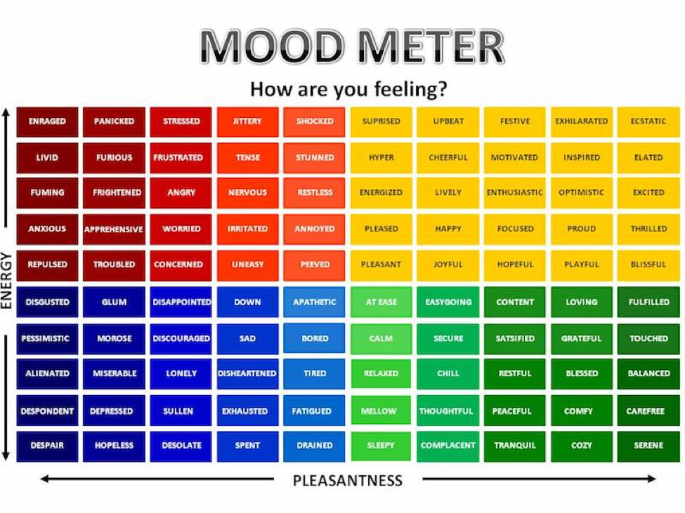

# BioBoost App

## Roadmap

- [x] Habit Stacks
  - [ ] Order habits
  - [ ] Frequency (weekly, on these days, etc.)
  - [ ] Time to begin / complete
- [x] Bad Habits
- [ ] Goals
  - [ ] Short term goals (within 2 months)
  - [ ] Medium term goals (within 2 years)
  - [ ] Long term goals (2+ years)
  - [ ] SMART goals
- [x] Mood
  - "great", "good", "okay", "bad", "awful"
  - 
  - additional notes
- [ ] Journal
  - 3 things to accomplish tomorrow
  - List things you are grateful for
  - Yearly, monthly self reflection journal
- [ ] Water tracker
- [x] Weight tracker
- [ ] Sleep tracker
  - No electronics past X
- [ ] Caffeine tracker
  - No caffeine past X time
  - No more than X mg of caffeine per day
  - Feature to slowely taper down
- [ ] Time boxing
- [ ] Workout tracker
- [ ] Cardio tracker
- [ ] Meal tracker
  - [ ] Meal planner
- [ ] Breathing exercises
- [ ] Meditation guides
- [ ] Intermittent fasting
- [ ] Stretching
  - [ ] Warm up / dynamic
  - [ ] Cool down / static
- [ ] Whiteboard
  - A place to write down ideas
